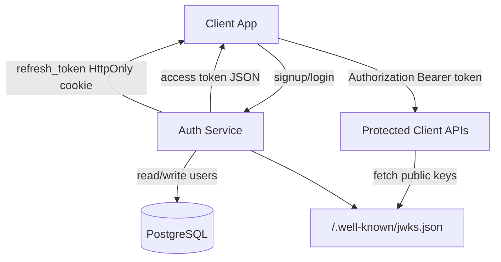

## Runtime Shape

## Main Packages

- `controller`: HTTP endpoints
- `service`: auth, token, and user logic
- `security`: JWT key loading and JWKS generation
- `config`: Spring Security, CORS, JWT, cookie, and auth properties
- `entity` and `repository`: user persistence
- `exception`: API error mapping

## Auth Flow

1. Client signs up or logs in with email and password.
2. Service validates credentials and role.
3. Service returns a short-lived access token in JSON.
4. Service sets a refresh token as an HttpOnly cookie.
5. Client sends access tokens as `Authorization: Bearer <token>`.
6. Client calls `POST /api/auth/refresh` with the refresh cookie and CSRF header to get a new access token.
7. Logout clears the refresh cookie.

## Design Choice

Token validity is proven cryptographically through RSA signatures, issuer, audience, and expiry validation. The database stores users, not token state.
